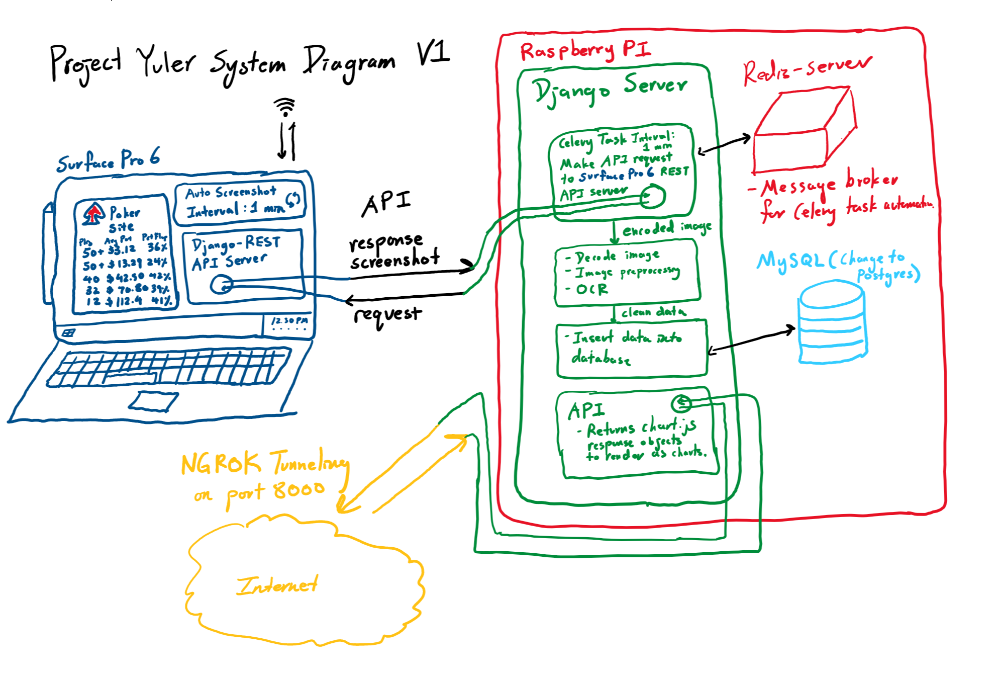

# Project Yuler
An Django web app that remembers online poker data. Uses said data to helper players make better decisions on when to play. 
## Live site
http://45471f846089.ngrok.io/ignition/
## System Diagram

## Naming
A pun that combines the famous Project Euler, and Udny Yule, the Yule in the Yule-Walker equations from time series analysis. 
