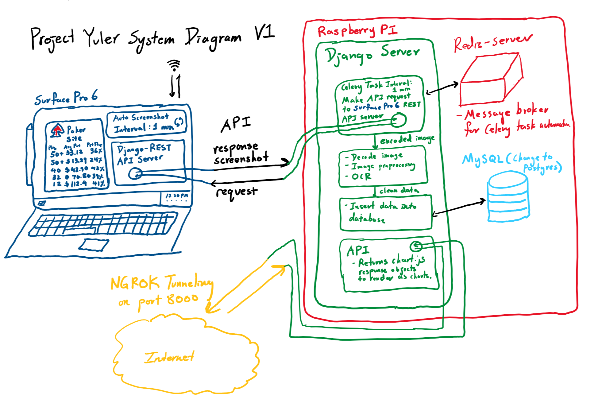

# Project Yuler
An Django web app that remembers online poker data. Uses said data to helper players make better decisions on when to play. 
## Live site
http://45471f846089.ngrok.io/ignition/
## System Diagram

## How It Works
- Terminal script on Windows captures screenshot of the poker GUI information.
- Image processing to "clean" the screenshot into an image that resembles a spreadsheet.
- PyTesseract OCR to parse the image into integers and floats.
- Django Celery Task that inputs the values into a database at a minute resolution.
- Chart.js to display the most recent 2 hours of data at each stake.
- ngrok forwards my locally running port to the outside world.
## Known Issues/Future Work
- Image Process/OCR is not perfect, need to tweak to get rid of bad parses.
- Ngrok is not best for production.
- Need to move from SQLite to Postgres
- Ignition Poker constantly changes their GUI, breaking the Image Process/OCR
- Build a model that can infer the number of players of a certains stake from the number of players at other stakes. This is because the number of players at all stakes should be correlated.
## Naming
A pun that combines the famous Project Euler, and Udny Yule, the Yule in the Yule-Walker equations from time series analysis. 
